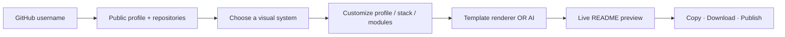
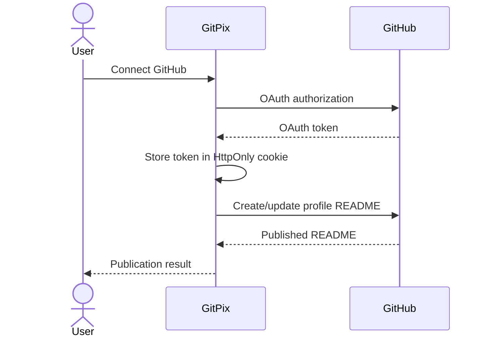
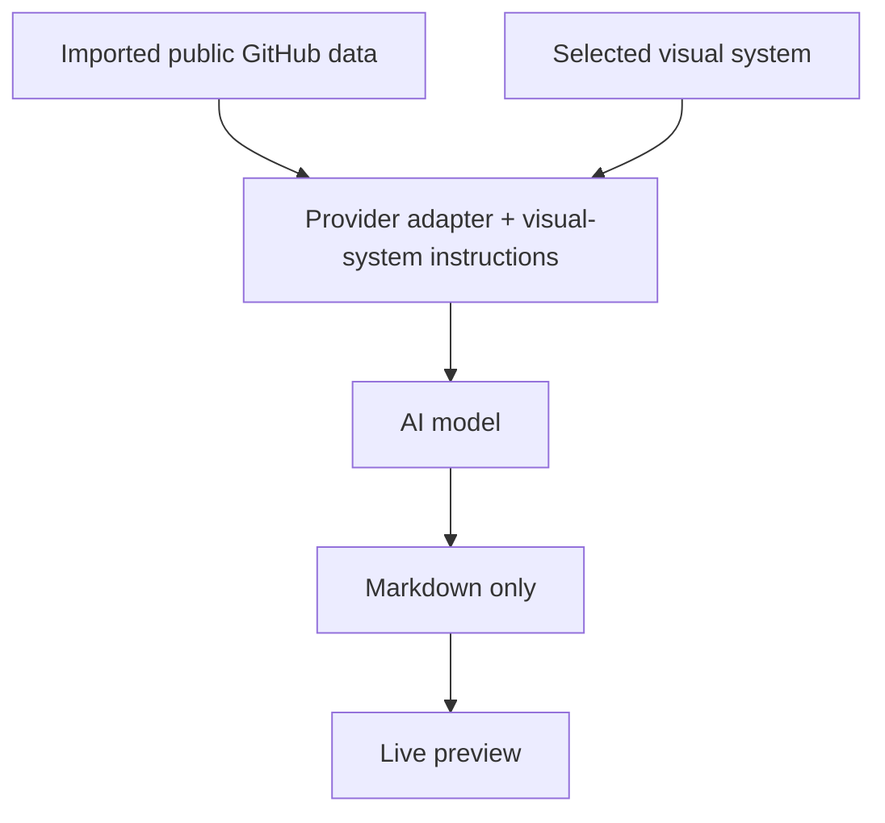

# GitPix

**Design your GitHub story.**

GitPix is a GitHub Profile README designer built around six genuinely different visual systems. Import a public GitHub profile, edit the details, generate a README from a deterministic template or with your own AI provider, preview it live, then copy, download or optionally publish it to the user's GitHub profile repository.

## The workflow



**How to read it:** GitPix turns public GitHub data into an editable visual system, renders it into Markdown, and lets the user take the finished README wherever they need it.

## Six visual systems

| System | Direction | Typography | Palette | Motion |
|---|---|---|---|---|
| **Ronin** | cinematic / editorial | Space Grotesk + DM Mono | crimson / ink / ivory | parallax + slash |
| **Terminal Ops** | CLI / system | JetBrains Mono | phosphor / black / amber | scanline |
| **Bento Grid** | modern / modular | Sora + IBM Plex Mono | cobalt / cloud / lime | card lift |
| **Editorial** | magazine / serif | DM Serif Display + Manrope | paper / burgundy / ink | page reveal |
| **Neon Signal** | cyber / glow | Space Grotesk + Fira Code | violet / cyan / void | glow pulse |
| **Pixel Forge** | retro / 8-bit | Press Start 2P + VT323 | peach / teal / plum | pixel blink |

The systems are not recolors: their visual composition and deterministic Markdown structure differ as well.

## GitHub integration

### Public import

No GitHub token is needed to import a public profile. GitPix's Python API validates the username, fetches public profile data and the user's most-starred repositories, caches results for five minutes and applies basic rate limiting.

Imported data includes:

- name, username and avatar
- bio, location and company
- website / public social metadata when available
- public repository count
- followers / following
- repository stars and descriptions
- detected repository languages

### Optional publishing

GitPix can publish `README.md` to the authenticated user's profile repository using GitHub OAuth.



Publishing is optional; the core designer works without an account or GitHub write permission.

## AI generation

AI generation happens server-side so the API key is never shipped to the browser.



GitPix supports OpenAI-compatible providers and Gemini. The model receives the imported public GitHub data plus the selected visual system and is instructed to produce only Markdown without inventing facts.

### Environment variables

```env
AI_API_KEY=your-provider-key
AI_PROVIDER=openai-compatible
AI_BASE_URL=https://api.openai.com/v1
AI_MODEL=gpt-4o-mini
GITHUB_CLIENT_ID=your-oauth-client-id
GITHUB_CLIENT_SECRET=your-oauth-client-secret
```

For Mistral or another OpenAI-compatible provider, change `AI_BASE_URL` and `AI_MODEL` while keeping `AI_PROVIDER=openai-compatible`.

For Gemini, use `AI_PROVIDER=gemini`.

## Stack

- **Frontend:** React + JavaScript, Vite, React Markdown, Lucide
- **Backend:** Python + FastAPI + HTTPX
- **GitHub:** public REST API + optional OAuth publishing
- **AI:** server-side provider adapter
- **Deployment:** Render-ready single-service configuration

## Local development

```bash
npm install
pip install -r requirements.txt
uvicorn server:app --reload --port 8000
npm run dev
```

Open `http://localhost:5173`.

## Production notes

- Keep `AI_API_KEY` server-side only.
- Use HTTPS in production so OAuth and GitHub cookies are marked secure.
- Configure the GitHub OAuth callback to the deployed origin plus `/api/github/oauth/callback`.
- Public GitHub import is cached to reduce upstream API pressure.
- AI generation is rate-limited server-side.
- The browser stores drafts locally; GitPix does not require a database for the core workflow.

## Brand

GitPix is a `.dot` product. The canonical GitPix mark is used as both the application logo and favicon. The `.dot` footer mark is shared with the rest of the `.dot` product family.

## License

MIT
